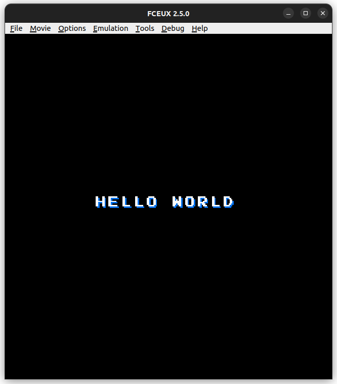

# Hello World in NES assembly

This "Hello world" code is based on the [Nerdy Nights tutorials](https://nerdy-nights.nes.science/#main_tutorial) on how to program games to NES.
The code here is mainly an adaptation of the week 3 code, where is shown how to display static sprites to the screen. To be more specific, I just implemmented the sprites section and the "string" label.

Here is the output shown when you load the ROM file:

## File - `helloWorld.asm`

This is the actual source code of the "Hello World" program. It includes comments explaining how the processor is gonna work through the instructions. Most of them I wrote myself in order to understand what is going on. I hope they can help you if you are will to study it.
If you are trying to understand it, I highly recommend you to read trhough the [Nesdev Wiki](https://www.nesdev.org/wiki/Nesdev_Wiki) as you try. It will be very usefull principally to understand the choice of addresses.

## File - `helloWorld.nes`

Its the actual ROM that displays the "Hello World" text. If you want to see it by yourself, donwload a NES emulator (I used the [FCEUX](https://fceux.com/web/download.html)) and load the rom.

## Folder - `/nerdy-nights-src`

I placed all the original source code inside this folder, so you can easily see the changes I made.

## File - `mario.chr`

The "mario.chr" file contains the tileset of the Super Mario Bros. 1 that I used to display the string in the screen. In order to visualize it, download a tile editor, like [Tile Molester](https://www.romhacking.net/utilities/109/) or [Tile Layer Pro](https://www.romhacking.net/utilities/108/). If you want, using those tools you can edit SMB sprites and make a "new" game.

## File - `helloWorld.fns`

This file only contains the NESASM substitutions of labels to real adresses used to create the ROM correctly.