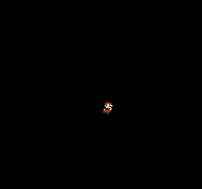

# Moving the Mario sprite in NES assembly

This code is based on the [Nerdy Nights tutorials](https://nerdy-nights.nes.science/#main_tutorial-5) on how to program games to NES. The code here is mainly an adaptation of the week 5 code, where is shown how to acces the controllers ports and making sprites move through controller inputs.
I myself did the whole Mario sprite move with the arrows of the controller (the tutorial teaches the moving with A and B buttons) and changed the color of the sprites.

Here is the output shown when you load the ROM file:

## File - `movingMario.asm`

This is the source code of the program. I've included a few comments on how the code is working, as well as an exemple of [Nesdev wiki](https://www.nesdev.org/wiki/Controller_reading_code) on how to read input from controllers addapted to my code - both of them work.

There's one thing worth noting, if you are trying to read controllers input through a bit organization: the location in memory of the mask matters. It's important to reserve space at the CPU's internal ram, otherwise, it is not possible to make operations like `ORA` and `ROL` with the mask address.

## File - `movingMario.nes`

This is the playable ROM file. If you want to test it, just download a NES emulator (I used [FCEUX](https://fceux.com/web/download.html)). As I said in the main README file, these games **do not** run on a real NES.

## Folder - `/nerdy-nights-src-controller`

The original Nerdy Nights source code of this project is available in this folder.

## File - `mario.chr`

The "mario.chr" file contains the tileset of the Super Mario Bros. 1 that I used to display the string in the screen. In order to visualize it, download a tile editor, like [Tile Molester](https://www.romhacking.net/utilities/109/) or [Tile Layer Pro](https://www.romhacking.net/utilities/108/).
